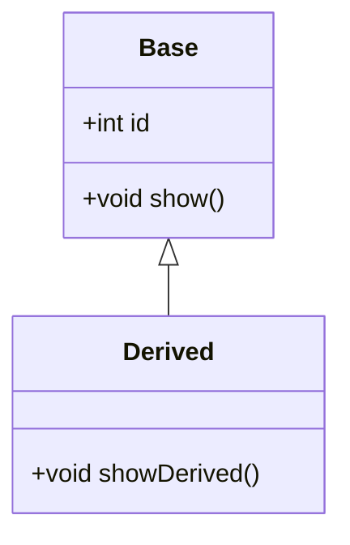
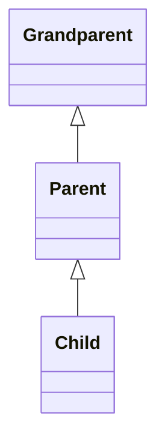
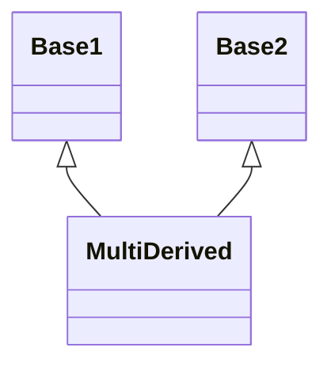
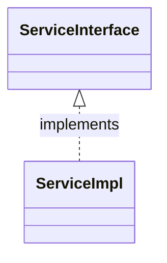
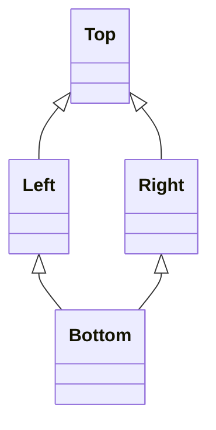

# Inheritance Diagrams (Mermaid)

This file contains simple Mermaid class diagrams illustrating common inheritance patterns used in this module. Render with any Mermaid-compatible viewer (GitHub, VS Code Mermaid Preview, or mermaid.live).

---

## 1) Single Inheritance

## 2) Multi-level Inheritance

## 3) Multiple Inheritance (C++ style)

Note: Java does not support multiple class inheritance; use interfaces instead.

## 4) Interface Implementation (Java style)

## 5) Diamond Problem (classical multiple inheritance)

Notes and guidance

- C++: multiple inheritance can create the diamond problem; use virtual inheritance (`virtual` base) to avoid duplicate subobjects.
- Java: prefer interfaces (default methods exist since Java 8); interfaces avoid the diamond object-layout issue.
- To preview locally: open this file in VS Code with a Mermaid preview extension, or paste diagram text to https://mermaid.live.

---
Small, focused visuals to complement the module README. If you want these embedded into the module README.md instead, say "embed" and I will merge them inline.